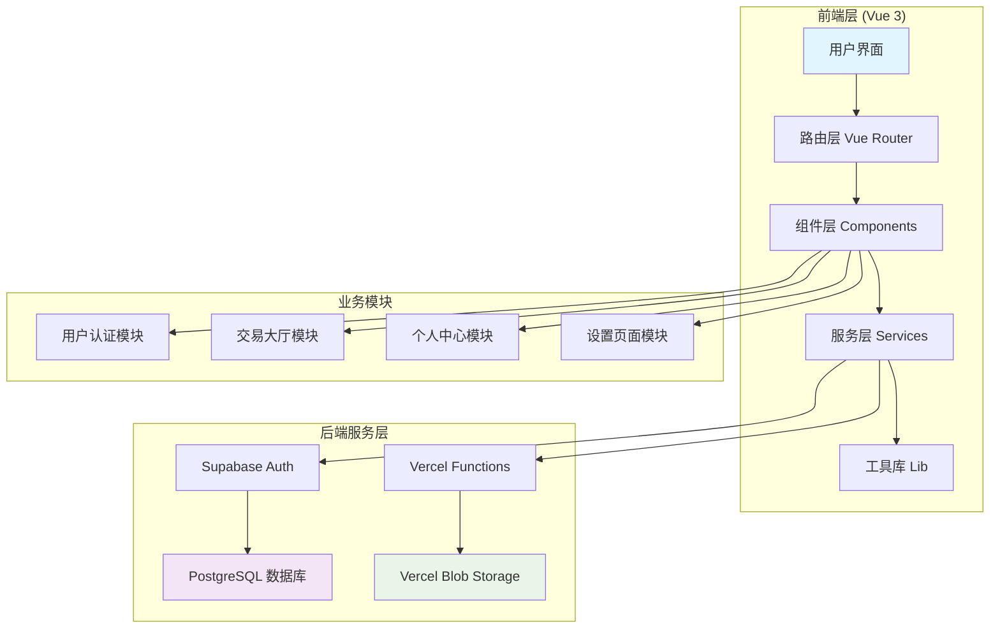

# 特斯拉 FSD 权限交易平台 - AI 上下文文档

> **项目摘要**：安全、便捷的特斯拉 FSD 完全自动驾驶权限担保交易服务，支持买卖、出租等多种交易方式，平台提供全程担保确保买卖双方权益。
>
> **初始化时间**：2025-10-24 14:01:12 UTC
>
> **项目类型**：Vue 3 + TypeScript + Supabase 全栈 Web 应用

## 🎯 项目愿景

特斯拉 FSD 权限交易平台致力于为特斯拉车主提供安全、透明的 FSD（Full Self-Driving）完全自动驾驶权限交易服务。通过平台化的担保机制，确保买卖双方的权益，让 FSD 权限的转让和租赁变得更加便捷和可靠。

### 核心价值主张
- **🛡️ 担保交易**：平台全程担保，资金安全有保障
- **⚡ 极速转移**：专业团队快速处理，FSD 权限转移流程高效便捷
- **💎 透明定价**：市场化定价机制，买卖双方自由协商，公开透明
- **📱 响应式设计**：支持桌面端和移动端，随时随地交易
- **🔐 用户认证**：Supabase 认证系统，安全可靠

## 🏗️ 架构总览

### 技术栈
- **前端框架**：Vue 3 (Composition API) + TypeScript
- **构建工具**：Vite 6.0 + Tailwind CSS 4.0
- **UI 组件库**：Shadcn-Vue (New York 风格)
- **状态管理**：Pinia
- **路由管理**：Vue Router 4
- **后端服务**：Supabase (Auth + PostgreSQL) + Vercel Functions
- **存储服务**：Vercel Blob Storage
- **部署平台**：Vercel

### 项目架构图



## 📁 模块索引

### 核心模块结构

```
falai-app/
├── src/                          # 前端源码 (主模块)
│   ├── views/                    # 页面组件
│   ├── components/               # UI 组件
│   ├── router/                   # 路由配置
│   ├── services/                 # 业务服务层
│   ├── lib/                      # 工具库
│   ├── types/                    # TypeScript 类型定义
│   └── composables/              # Vue 组合式函数
├── api/                          # Vercel Serverless 函数 (API 模块)
├── supabase/                     # Supabase 配置和迁移 (数据库模块)
└── public/                       # 静态资源
```

### 已识别模块

| 模块名称 | 路径 | 类型 | 状态 | 描述 |
|---------|------|------|------|------|
| **前端主模块** | `/src/` | Vue 3 应用 | ✅ 活跃 | 主要的前端应用代码 |
| **API 模块** | `/api/` | Serverless 函数 | ✅ 活跃 | Vercel Functions API |
| **数据库模块** | `/supabase/` | Supabase 配置 | ✅ 活跃 | 数据库模式和配置 |

## 📋 全局规范

### 代码规范
- **TypeScript 严格模式**：启用 `strict: true`
- **组件命名**：PascalCase (如 `UserMenu.vue`)
- **文件命名**：PascalCase (组件) / kebab-case (路由)
- **CSS 规范**：优先使用 Tailwind 原子类
- **Vue 风格**：Composition API + `<script setup>`

### Git 提交规范
```
feat: 新功能
fix: 修复 bug
docs: 文档更新
style: 代码格式调整
refactor: 重构
test: 测试相关
chore: 构建/工具链相关
```

### 环境变量配置
```env
# Supabase 配置
VITE_SUPABASE_URL=your_supabase_url
VITE_SUPABASE_ANON_KEY=your_supabase_anon_key

# Vercel Blob 存储
BLOB_READ_WRITE_TOKEN=your_blob_token
```

## 🚀 开发工作流

### 本地开发
```bash
# 安装依赖
pnpm install

# 启动开发服务器
pnpm dev

# 构建生产版本
pnpm build

# 预览生产构建
pnpm preview
```

### 部署流程
- **主分支**：自动部署到 Vercel 生产环境
- **Pull Request**：自动部署到预览环境
- **环境变量**：通过 Vercel Dashboard 配置

## 🔐 安全特性

- ✅ Supabase Row Level Security (RLS) 数据隔离
- ✅ JWT Token 认证
- ✅ HTTPS 加密传输
- ✅ 密码哈希存储
- ✅ 担保交易机制

## 📊 覆盖率统计

### 扫描覆盖情况
- **已扫描文件数**：25+ 个核心文件
- **估算总文件数**：约 80 个文件
- **覆盖率**：约 31%
- **已覆盖模块**：3 个模块
- **主要缺口**：组件层细节、API 具体实现、数据库结构

### 建议下一步深挖的路径
1. **组件层**：`src/components/ui/` - Shadcn-Vue 组件库细节
2. **API 实现**：`api/` - Vercel Functions 具体逻辑
3. **数据库结构**：`supabase/` - 数据库表结构和 RLS 策略
4. **类型定义**：`src/types/` - 完整的 TypeScript 类型系统
5. **组合式函数**：`src/composables/` - Vue 3 逻辑复用

---

## 📚 模块导航

- **[前端主模块详情](./src/CLAUDE.md)** ← 点击查看模块级文档
- **[API 模块详情](./api/CLAUDE.md)** ← 计划中
- **[数据库模块详情](./supabase/CLAUDE.md)** ← 计划中

---

*此文档由 init-architect 自动生成，最后更新：2025-10-24 14:01:12 UTC*