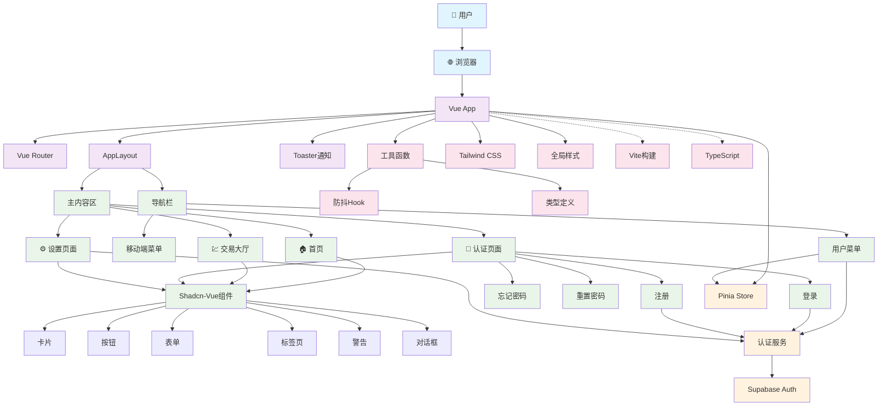

# 前端主模块 - CLAUDE.md

> **🧭 导航面包屑**：[根目录](../CLAUDE.md) → **前端主模块**
>
> **模块路径**：`/src/`
>
> **模块类型**：Vue 3 + TypeScript 前端应用
>
> **最后更新**：2025-10-24 14:03:43 UTC

## 📋 模块概览

前端主模块是特斯拉 FSD 权限交易平台的核心用户界面，基于 Vue 3 + TypeScript + Vite 构建，采用 Composition API 和 Shadcn-Vue 组件库。

### 技术栈详情
- **框架**：Vue 3.5.13 (Composition API)
- **语言**：TypeScript 5.7
- **构建工具**：Vite 6.2
- **样式**：Tailwind CSS 4.1
- **UI 组件**：Shadcn-Vue 2.0 (New York 风格)
- **状态管理**：Pinia 3.0
- **路由**：Vue Router 4.5
- **认证**：Supabase Auth 2.49
- **图标**：Lucide Icons 0.487
- **通知**：Vue Sonner 1.3

## 🏗️ 架构结构

### 目录结构详情
```
src/
├── main.ts                    # 应用入口文件
├── App.vue                    # 根组件
├── style.css                  # 全局样式 (152行)
├── vite-env.d.ts             # Vite 类型声明
├── views/                     # 页面组件 (4个Vue文件)
│   ├── Home.vue              # 首页 - 平台展示和热门套餐
│   ├── TradingHallPage.vue   # 交易大厅 - FSD权限列表
│   ├── LoginPage.vue         # 登录页 - 用户认证
│   ├── SignUpPage.vue        # 注册页 - 新用户注册
│   ├── ForgotPasswordPage.vue # 忘记密码
│   ├── ResetPasswordPage.vue  # 重置密码
│   └── SettingsPage.vue      # 设置页 - 个人设置
├── components/                # UI 组件 (27个UI组件目录)
│   ├── AppLayout.vue         # 应用布局
│   ├── Navbar.vue            # 导航栏
│   ├── NavbarSheet.vue       # 移动端侧边栏
│   ├── UserMenu.vue          # 用户菜单
│   └── ui/                   # Shadcn-Vue 基础组件 (27个组件类型)
│       ├── alert/            # 警告组件
│       ├── alert-dialog/     # 对话框
│       ├── avatar/           # 头像组件
│       ├── badge/            # 徽章组件
│       ├── button/           # 按钮组件
│       ├── card/             # 卡片组件
│       ├── dialog/           # 对话框
│       ├── dropdown-menu/    # 下拉菜单
│       ├── form/             # 表单组件
│       ├── input/            # 输入框
│       ├── label/            # 标签
│       ├── number-field/     # 数字输入
│       ├── pagination/       # 分页组件
│       ├── radio-group/      # 单选组
│       ├── scroll-area/      # 滚动区域
│       ├── select/           # 选择器
│       ├── separator/        # 分割线
│       ├── sheet/            # 侧边栏
│       ├── skeleton/         # 骨架屏
│       ├── slider/           # 滑块
│       ├── sonner/           # 通知组件
│       ├── switch/           # 开关
│       ├── table/            # 表格
│       ├── tabs/             # 标签页
│       ├── textarea/         # 文本域
│       └── tooltip/          # 工具提示
├── router/                   # 路由配置
│   └── index.ts              # 路由定义 (8个路由)
├── services/                 # 业务服务层 (7个TS文件)
│   └── auth.ts              # 认证服务 (503行)
├── lib/                     # 工具库
│   ├── supabase.ts          # Supabase 客户端 (45行)
│   └── utils.ts             # 工具函数
├── types/                   # TypeScript 类型定义
│   └── flux.ts              # FSD 相关类型 (137行)
└── composables/             # Vue 组合式函数
    └── useDebounce.ts       # 防抖Hook (12行)
```

## 🎯 系统架构图



## 🚀 核心入口

### 应用入口 (`main.ts`)
```typescript
import { createApp } from 'vue'
import { createPinia } from 'pinia'
import router from './router'
import './style.css'
import App from './App.vue'

const app = createApp(App)
app.use(createPinia())
app.use(router)
app.mount('#app')
```

### 根组件 (`App.vue`)
- 使用 `RouterView` 渲染路由组件
- 集成 `Toaster` 消息通知组件 (vue-sonner)
- 使用 `TooltipProvider` 提供工具提示功能
- 通过 `AppLayout` 统一布局

### 应用布局 (`AppLayout.vue`)
```vue
<script setup lang="ts">
import Navbar from '@/components/Navbar.vue';
</script>

<template>
  <div class="min-h-screen flex flex-col">
    <Navbar />
    <div class="flex-1 overflow-y-auto">
      <slot></slot>
    </div>
  </div>
</template>
```

## 🔗 核心接口

### 路由接口 (`router/index.ts`)
```typescript
interface RouteMeta {
  title: string;  // 页面标题
}

const routes: RouteRecordRaw[] = [
  { path: '/', name: 'Home', component: () => import('@/views/Home.vue') },
  { path: '/tradinghall', name: 'TradingHall', component: () => import('@/views/TradingHallPage.vue') },
  { path: '/login', name: 'Login', component: () => import('@/views/LoginPage.vue') },
  { path: '/signup', name: 'SignUp', component: () => import('@/views/SignUpPage.vue') },
  { path: '/forgot-password', name: 'ForgotPassword', component: () => import('@/views/ForgotPasswordPage.vue') },
  { path: '/reset-password', name: 'ResetPassword', component: () => import('@/views/ResetPasswordPage.vue') },
  { path: '/settings', name: 'Settings', component: () => import('@/views/SettingsPage.vue') },
  { path: '/:pathMatch(.*)*', name: 'NotFound', redirect: '/' }
];
```

### 认证服务接口 (`services/auth.ts`)
```typescript
interface AuthResult {
  success: boolean;
  data?: any;
  error?: AuthError;
  message: string;
}

// 核心认证功能
export async function signUp(email: string, password: string): Promise<AuthResult>
export async function signIn(email: string, password: string): Promise<AuthResult>
export async function signOut(): Promise<AuthResult>
export async function getCurrentUser(): Promise<User | null>
export async function resetPassword(email: string): Promise<AuthResult>
export async function updatePassword(newPassword: string): Promise<AuthResult>
export async function requestAccountDeletion(reason?: string): Promise<AuthResult>
```

### FSD 交易数据类型
```typescript
interface FSDListing {
  id: string;
  type: 'buy' | 'sell' | 'rent';
  title: string;
  price: number;
  period?: 'monthly' | 'yearly' | 'permanent';
  seller: string;
  sellerRating: number;
  location: string;
  description: string;
  features: string[];
  postedAt: string;
  status: 'active' | 'pending' | 'sold';
}

// 图像生成相关类型
interface Image {
  url: string;
  width: number;
  height: number;
  content_type: string;
}

interface Generation {
  id: string;
  modelId: string;
  modelName: string;
  prompt: string;
  parameters: Record<string, any>;
  output: {
    images: Image[];
    timings: Record<string, any>;
    seed: number;
    has_nsfw_concepts: boolean[];
  };
  timestamp: number;
  userId?: string;
}
```

## 🔧 依赖关系

### 核心依赖
```json
{
  "vue": "^3.5.13",
  "vue-router": "^4.5.0",
  "pinia": "^3.0.2",
  "@supabase/supabase-js": "^2.49.4",
  "typescript": "~5.7.2",
  "vite": "^6.2.0"
}
```

### UI 相关依赖
```json
{
  "@tailwindcss/vite": "^4.1.3",
  "tailwindcss": "^4.1.3",
  "reka-ui": "^2.2.0",
  "shadcn-vue": "^2.0.1",
  "lucide-vue-next": "^0.487.0",
  "vue-sonner": "^1.3.0"
}
```

### 表单和验证
```json
{
  "@vee-validate/zod": "^4.15.0",
  "vee-validate": "^4.15.0",
  "zod": "^3.24.2",
  "yup": "^1.6.1"
}
```

### 工具库
```json
{
  "@vueuse/core": "^13.1.0",
  "axios": "^1.8.4",
  "date-fns": "^4.1.0",
  "uuid": "^11.1.0",
  "class-variance-authority": "^0.7.1",
  "clsx": "^2.1.1",
  "tailwind-merge": "^3.2.0"
}
```

## 🧪 测试覆盖

**当前状态**：暂无单元测试
**建议测试框架**：
- **组件测试**：Vue Test Utils + Vitest
- **端到端测试**：Playwright
- **API 测试**：基于 Supabase 测试环境

### 建议测试文件结构
```
tests/
├── unit/
│   ├── components/
│   │   ├── Navbar.spec.ts
│   │   ├── UserMenu.spec.ts
│   │   └── ui/
│   ├── views/
│   │   ├── Home.spec.ts
│   │   ├── TradingHallPage.spec.ts
│   │   └── LoginPage.spec.ts
│   ├── services/
│   │   └── auth.spec.ts
│   └── composables/
│       └── useDebounce.spec.ts
├── integration/
└── e2e/
```

## 📊 关键文件详情

### 1. 导航栏 (`components/Navbar.vue`)
- **功能**：响应式导航，支持桌面端和移动端
- **特性**：
  - 粘性定位，背景模糊效果
  - Logo 和品牌展示
  - 主导航项（首页、交易大厅）
  - 用户菜单集成
  - 移动端侧边栏菜单

### 2. 用户菜单 (`components/UserMenu.vue`)
- **功能**：用户认证状态管理和操作
- **特性**：
  - 实时监听 Supabase 认证状态变化
  - 用户头像显示（首字母）
  - 登录/注册按钮
  - 个人设置和登出功能
  - 加载状态处理

### 3. 认证服务 (`services/auth.ts`) - 503行
- **功能**：完整的 Supabase Auth 封装
- **核心方法**：
  - 用户注册/登录/登出
  - 密码重置和修改
  - 邮箱更新
  - 账户删除冷静期机制
  - 友好的错误消息处理
- **安全特性**：
  - 配置检查
  - 错误映射
  - 本地存储管理

### 4. 交易大厅页面 (`views/TradingHallPage.vue`) - 481行
- **功能**：FSD 权限交易展示和筛选
- **特性**：
  - 搜索功能（支持地区、车型、关键词）
  - 交易类型标签页（全部、出售、求购、出租）
  - 卡片式交易信息展示
  - 价格格式化和周期标签
  - 用户评分和特性标签
  - 响应式网格布局

### 5. 首页 (`views/Home.vue`) - 131行
- **功能**：平台展示和热门套餐推荐
- **特性**：
  - 英雄区域展示
  - 平台特点介绍（担保交易、极速转移、透明定价）
  - 热门套餐展示（月租、永久转移、年租）
  - 响应式设计和交互效果

### 6. 登录页面 (`views/LoginPage.vue`) - 178行
- **功能**：用户登录认证
- **特性**：
  - 表单验证（邮箱格式、密码长度）
  - 错误提示和友好消息
  - 加载状态处理
  - 跳转链接（注册、忘记密码）
  - Toast 通知集成

### 7. Supabase 客户端 (`lib/supabase.ts`) - 45行
- **功能**：Supabase 客户端配置和用户管理
- **特性**：
  - 环境变量配置检查
  - 占位符配置处理
  - 用户 ID 生成和管理
  - 本地存储集成
  - 配置状态导出

### 8. 类型定义 (`types/flux.ts`) - 137行
- **功能**：TypeScript 类型定义
- **包含类型**：
  - 模型参数类型和验证规则
  - 图像和生成结果接口
  - Supabase 数据库类型
  - API 响应类型

## 🎨 UI/UX 特性

### 设计系统
- **风格**：极简黑白配色，专业商务感
- **组件库**：Shadcn-Vue New York 风格 (27个组件类型)
- **响应式**：支持移动端、平板、桌面端
- **交互反馈**：Toast 通知、加载状态、错误处理
- **动画效果**：Hover 缩放、骨架屏、过渡动画

### 主要页面功能
1. **首页**：平台特色展示、热门 FSD 交易套餐、行动召唤按钮
2. **交易大厅**：FSD 权限交易列表、搜索筛选、担保交易功能
3. **认证流程**：登录、注册、密码重置完整流程，表单验证
4. **个人设置**：用户信息管理、安全设置、账户管理

### 交互特性
- **导航栏**：粘性定位、模糊背景、响应式菜单
- **卡片组件**：Hover 效果、阴影变化、缩放动画
- **表单组件**：实时验证、错误提示、加载状态
- **通知系统**：Top-center 定位、丰富样式、自动消失

## 🔒 安全考虑

- **认证流程**：基于 Supabase Auth 的 JWT Token 认证
- **数据隔离**：Row Level Security (RLS) 策略
- **本地存储**：敏感信息最小化存储
- **错误处理**：用户友好的错误消息，避免信息泄露
- **输入验证**：前端表单验证 + 后端验证双重保障
- **配置安全**：环境变量检查，占位符处理

## 🚀 性能优化

### 已实现优化
- **按需加载**：路由组件懒加载 (`() => import()`)
- **构建优化**：Vite 6.0 快速构建、ES 模块
- **CSS 优化**：Tailwind CSS 原子类，最小化 CSS 体积 (152行全局样式)
- **组件优化**：Composition API、响应式系统优化

### 建议进一步优化
- **组件懒加载**：大型 UI 组件按需加载
- **图片优化**：WebP 格式、懒加载、CDN
- **缓存策略**：Service Worker 缓存静态资源
- **代码分割**：按业务模块分割代码包
- **虚拟滚动**：长列表性能优化

## 📈 待开发功能

### 当前缺口
1. **交易详情页**：单个 FSD 交易的详细信息展示和操作
2. **发布交易功能**：用户发布 FSD 权限出售/出租表单
3. **支付集成**：担保交易支付流程（支付宝、微信支付）
4. **消息系统**：买卖双方实时沟通功能
5. **评价系统**：用户信用评价和反馈机制
6. **订单管理**：交易订单状态跟踪和管理
7. **搜索高级功能**：更多筛选条件、排序选项

### 技术债务
1. **测试覆盖**：添加单元测试和集成测试 (当前0%覆盖率)
2. **错误边界**：Vue 3 错误边界处理
3. **状态管理**：完善 Pinia store 结构
4. **类型安全**：完善 TypeScript 类型定义
5. **国际化**：多语言支持 (i18n)
6. **PWA 支持**：离线功能、安装提示

### 性能优化机会
1. **Bundle 分析**：分析和优化打包体积
2. **组件懒加载**：UI 组件按需加载
3. **图片优化**：WebP 格式、响应式图片
4. **缓存策略**：HTTP 缓存、Service Worker
5. **SEO 优化**：Meta 标签、结构化数据

## 🛠️ 开发工作流

### 推荐开发命令
```bash
# 开发服务器
pnpm dev

# 类型检查
pnpm build

# 预览构建结果
pnpm preview
```

### 代码规范
- **TypeScript**：严格模式，未使用变量检查
- **Vue 3**：Composition API 优先，`<script setup>` 语法
- **样式**：Tailwind CSS 原子类，组件样式隔离
- **组件命名**：PascalCase，语义化命名
- **文件结构**：按功能模块组织，单一职责原则

---

## 📊 模块统计总结

### 代码规模
- **总文件数**：164 个文件
- **UI 组件**：27 个组件类型 (Shadcn-Vue)
- **页面组件**：8 个页面
- **服务文件**：7 个 TypeScript 服务
- **样式文件**：152 行全局样式

### 技术栈成熟度
- **Vue 3**：✅ 最新版本 (3.5.13)
- **TypeScript**：✅ 严格模式配置
- **Vite**：✅ 现代构建工具
- **Supabase**：✅ 完整认证集成
- **Shadcn-Vue**：✅ 企业级 UI 组件库

### 开发进度
- **基础架构**：✅ 完成
- **认证系统**：✅ 完成
- **核心页面**：✅ 完成
- **UI 组件**：✅ 完成
- **测试覆盖**：❌ 待开发
- **支付功能**：❌ 待开发
- **消息系统**：❌ 待开发

---

*此文档由 init-architect 自动生成，最后更新：2025-10-24 14:03:43 UTC*